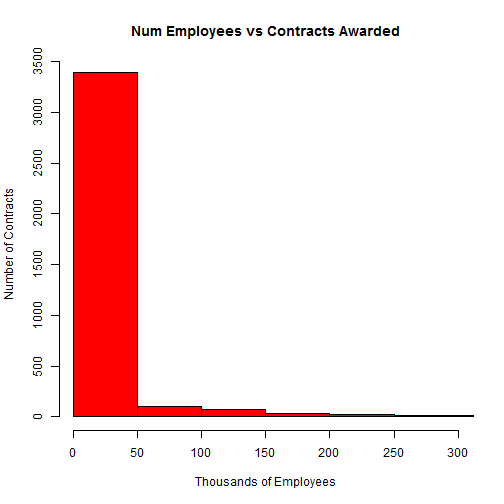

US Government Federal Contracts in FY14
========================================================
author: Chuck F
date: 15 May 2015
This was done for the Creating Data Products Course, by Johns Hopkins University at Coursera.org

Why Federal Contracts
========================================================

Why not? Aren't you curious about how our (US) government is spending it's money?
What I'd like to do:
- Discover where money is being spent
- Identify what types of organizations are winning contracts
- Identify the size of the organizations using our money!

Where's the Data?
========================================================
All this data is freely available!
* http://download.usaspending.gov/datadownlods/Contracts/988f3e3b/Data_Feed.csv
* Only - that's 405k contracts!
  + Much too large for this project.
  + I've randomly sampled it down to 5k

How many employees are in these companies winning contracts?
========================================================

 
What else would be nice to look at?
========================================================
I didn't have enough time/energy but...
* I'd like to compare the Number of Employees versus Amount of Award
* I'd like to know where the companies are located versus the Place of Performance

Lastly
========================================================
Thanks for looking!
